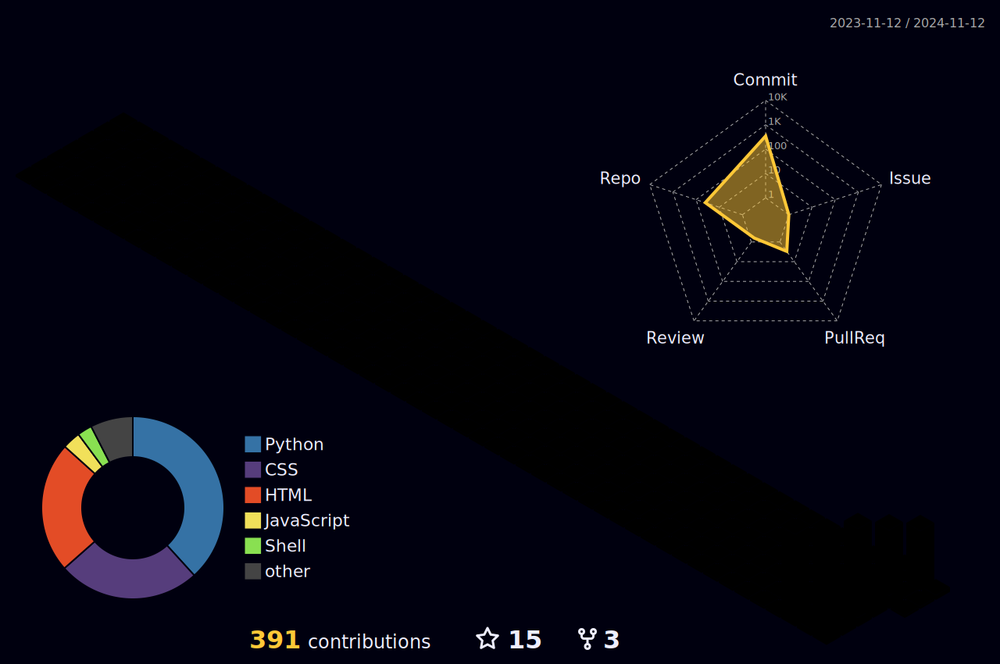

  
  <!-- Animated Header -->
  
  
  <!-- Profile Views & Social Links -->
  

    
    
    
  

  <!-- Animated Banner -->
  

<!-- GitHub Snake Animation -->
<picture>
  <source
    media="(prefers-color-scheme: dark)"
    srcset="https://raw.githubusercontent.com/likhonisaac/likhonisaac/output/github-snake-dark.svg"
  />
  <source
    media="(prefers-color-scheme: light)"
    srcset="https://raw.githubusercontent.com/likhonisaac/likhonisaac/output/github-snake.svg"
  />
  
</picture>

<!-- Alternative Snake Animations -->

  
  

## 🛠️ Tech Stack

  <!-- Development -->
   
  <!-- Tools & Platforms -->
   
  <!-- Development Tools -->
  

## 📊 GitHub Stats

  <!-- 3D Contribution Calendar -->
  
  
  <!-- GitHub Stats Cards -->
  
  
  
  <!-- Language Stats -->
  

## 🏆 GitHub Trophies

  

## 📈 Contribution Graph

## 🎯 Recent Activity
<!--START_SECTION:activity-->
<!--END_SECTION:activity-->

<!-- Spotify Now Playing -->

  

---

  <b>Let's connect and build something amazing together!</b>
  

    💼 Open for collaborations and opportunities 
    📫 Reach me on <a href="https://t.me/RektDevelopers">Telegram</a> 
    🌐 Visit my website: <a href="https://likhon.xyz">likhon.xyz</a>
  

