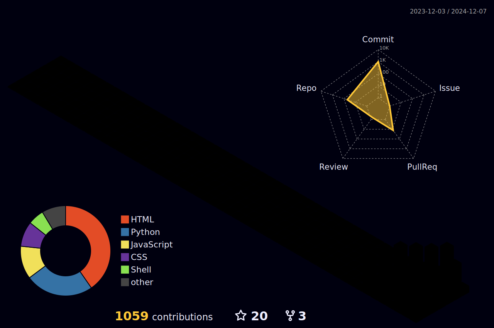

# Likhon Isaac's GitHub Profile

<div align="center">


<p>
  <a href="https://github.com/likhonisaac">
    
  </a>
  
  <a href="https://likhon.xyz">
    
  </a>
</p>


## 👨‍💻 About Me

```typescript
const Likhon = {
  role: "Full Stack Developer",
  location: "Bangladesh 🇧🇩",
  languages: ["TypeScript", "Python", "Go", "JavaScript"],
  expertise: ["Cloud Architecture", "DevOps", "System Design"],
  currentFocus: [
    "Building scalable web applications",
    "Contributing to open source",
    "Learning new technologies"
  ],
  funFact: "I debug code by talking to my rubber duck 🦆"
};
```

## 📊 GitHub Statistics

<table>
  <tr>
    <td width="50%">
      
    </td>
    <td width="50%">
      
    </td>
  </tr>
  <tr>
    <td colspan="2">
      
    </td>
  </tr>
</table>

## 🐍 Snake Animation


## 📆 3D Contribution Calendar



## 🛠️ Tech Stack

<div align="center">
  <!-- Development -->
  <h3>Development</h3>
  <br/>
  
  <!-- Infrastructure -->
  <h3>Infrastructure</h3>
  <br/>
  
  <!-- Tools -->
  <h3>Tools</h3>
  
</div>

<div align="center">
  
</div>

## 🎯 Recent Activities

<div align="center">
  
</div>

## 🏆 GitHub Achievements

<div align="center">
  
</div>


## 🤝 Let's Connect

<div align="center">
  <p>
    <b>Open for collaborations and exciting projects!</b><br>
    💼 Available for new opportunities<br>
    📫 Reach me on <a href="https://github.com/likhonisaac">GitHub</a> or via email<br>
    🌐 Visit my website: <a href="https://likhon.dev">likhon.dev</a>
  </p>
</div>


</div>
